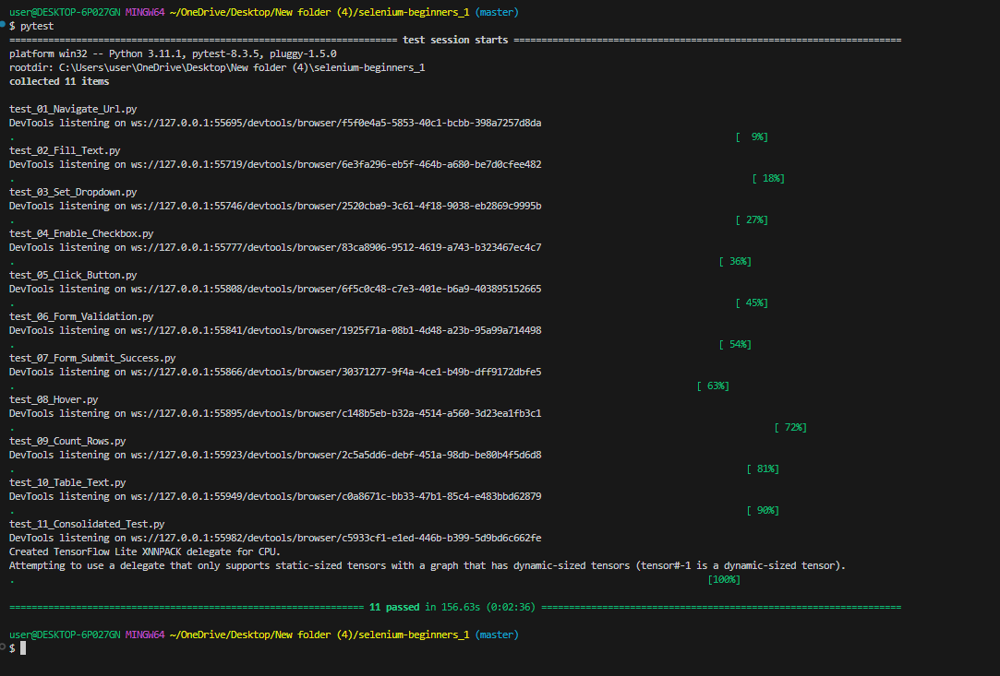

## 🔍 Day-6: PyTest, ML Model Testing & Industry Insights
Day-6 of the Skill Lab offered a deep dive into testing machine learning models and provided valuable insights into the tech industry. The session began with an introduction to PyTest, one of Python’s most powerful testing frameworks. We learned how to write and run test cases, with a special focus on validating machine learning models. Through hands-on exercises, we gained practical experience in assessing model performance, verifying outputs, and ensuring that the models were robust enough for real-world use.

A standout aspect of the day was the mentorship provided by Avinash Sir and Shivhari Sir. Their enthusiasm and unwavering support created an encouraging learning environment. They made sure to address every question, offer clear explanations, and keep the session interactive and engaging. Their optimism was contagious, and they motivated us to dig deeper and explore beyond the basic concepts.

As the session progressed, we received invaluable industry insights from the mentors. They shared perspectives on how newcomers can successfully enter the tech world, what skills are in demand, and how to approach job opportunities with confidence. The conversation also touched on preparing for roles in tech companies, which gave us a clear roadmap for launching our careers in the industry.

In summary, Day-6 not only equipped us with technical skills for testing ML models but also inspired us with practical career advice and knowledge about the current tech job market. It was a day of learning, growth, and motivation.

